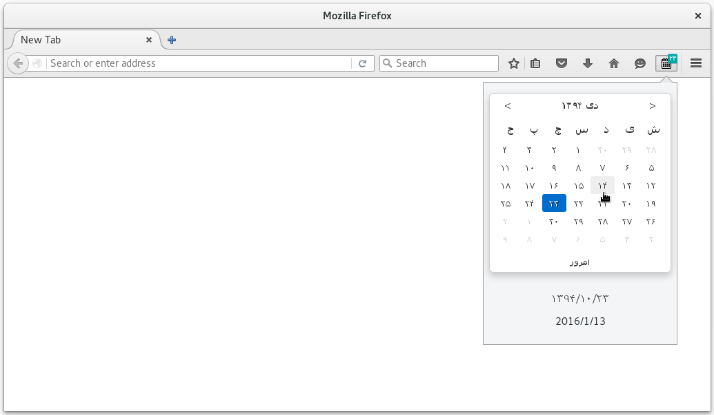
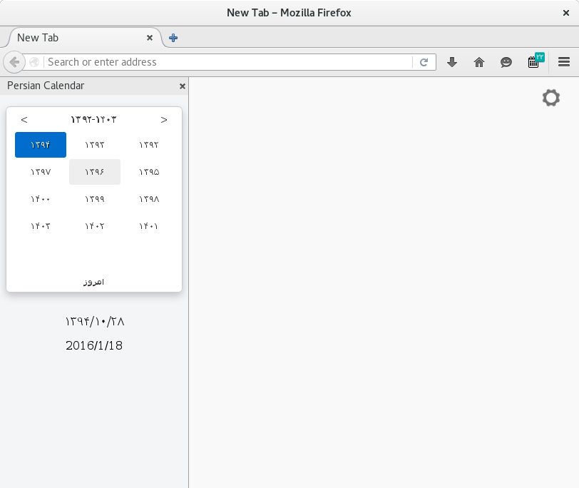

# Persian-Calendar-for-Firefox
Firefox Extension for Shows Persian date (Jalali Caledar)

## Installation
The addon is available on the [Mozilla Addons library](https://addons.mozilla.org/en-US/firefox/addon/persian-calendar/).

## Acknowledgment
Reza Babakhani: https://github.com/babakhani/pwt.datepicker
